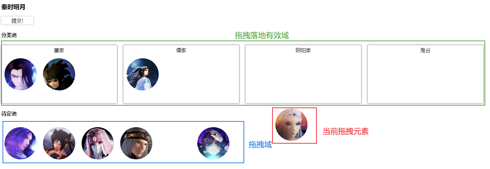

### 元素拖拽移动

``` js
var moveToX = 0
var moveToY = 0
var disX = 0
var disY = 0
var target = null

function init (query) {
  var dragElms = null
  dragElms = document.querySelectorAll(query)
  if (!dragElms || !dragElms.length) {
    dragElms = null
    return
  }
  dragElms.forEach(elm => {
    elm.onmousedown = mouseDown
  })
  dragElms = null
}

function mouseDown (e) {
  var event = e || window.event
  target = event.target || event.srcElement
  disX = event.clientX - target.offsetLeft
  disY = event.clientY - target.offsetTop

  // 绑定事件到document,解决鼠标滑动过快到div外
  document.onmousemove = mouseMove
  document.onmouseup = mouseUp
}

function mouseMove (e) {
  var event = e || window.event
  moveToX = event.clientX - disX
  moveToY = event.clientY - disY
  target.style.left = `${moveToX}px`
  target.style.top = `${moveToY}px`
}

function mouseUp (e) {
  var event = e || window.event
  var res = confirm('确定移动到该位置？')
  if (!res) {
    target.style.left = 0
    target.style.top = 0
  }
  moveToX = 0
  moveToY = 0
  disX = 0
  disY = 0
  document.onmousemove = null
  document.onmouseup = null
}

init('div[class=dom_name]')
```
### 元素拖拽移动 + 有效域
- 支持拖拽
- 支持拖拽域合法性(自定义合法规则)判断



[代码地址](https://github.com/xiaowao/common-lib/tree/master/src/drag)